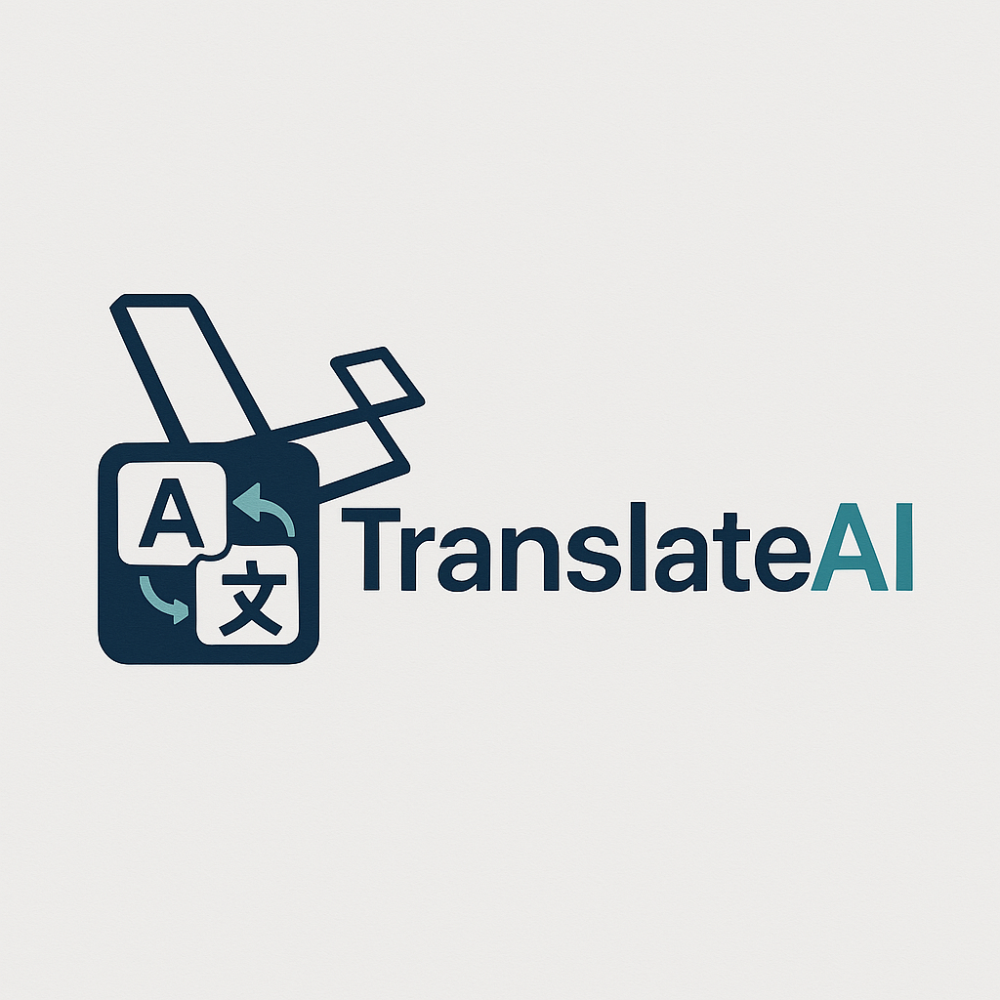
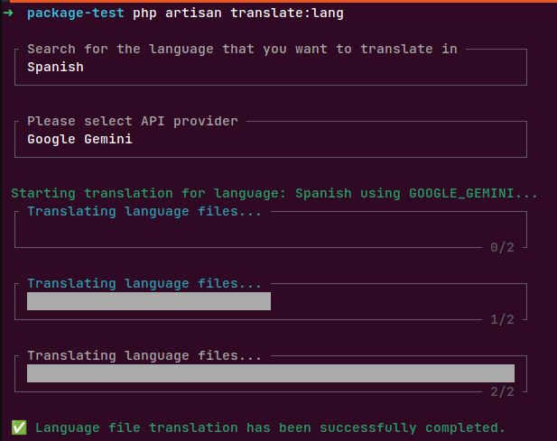

```markdown
# Laravel Language AI Translate

[](https://packagist.org/packages/genius-asif/laravel-lang-ai-translate)
[](https://github.com/genius-asif/laravel-lang-ai-translate/actions?query=workflow%3Arun-tests+branch%3Amain)
[](https://github.com/genius-asif/laravel-lang-ai-translate/actions?query=workflow%3A"Fix+PHP+code+style+issues"+branch%3Amain)
[](https://packagist.org/packages/genius-asif/laravel-lang-ai-translate)

<p align="center">
    
</p>

<h1 align="center">
    Laravel Lang AI Translate v1.0.0
</h1>

Effortlessly translate your Laravel language files from English to multiple languages using powerful AI APIs like Google Gemini, OpenAI, and DeepSeek. Automate your localization workflow and reach a global audience with ease.

## Key Features

-   **AI-Powered Translation:** Leverage the capabilities of Google Gemini, OpenAI, and DeepSeek for accurate and efficient translations.
-   **Automated Workflow:** Simplify your translation process by automating the translation of entire language files.
-   **Multiple Language Support:** Translate to a wide range of languages supported by the integrated AI APIs.
-   **Easy Integration:** Seamlessly integrate into your Laravel project with a simple Artisan command.
-   **Configurable Providers:** Easily switch between different AI translation providers based on your needs and preferences.

## Installation

You can install the package via Composer:

```bash
composer require genius-asif/laravel-lang-ai-translate
```

Publish the configuration file:

```bash
php artisan vendor:publish --tag="lang-ai-translation"
```

This will create a `config/lang-ai-translation.php` file where you can configure your LLM API keys and language settings.

**Configuration:**

Open the `config/lang-ai-translation.php` file and add your API keys for the desired translation providers:

```php
<?php

return [
    'languages' => [
        'hi' => 'Hindi',
        'es' => 'Spanish',
        'fr' => 'French',
        'ur' => 'Urdu',
    ],
    'providers' => [
        'google_gemini' => [
            'key' => env('GOOGLE_GEMINI_API_KEY', ''),
            'url' => env('GOOGLE_GEMINI_API_URL', '[https://generativelanguage.googleapis.com/v1beta/models/gemini-2.0-flash:generateContent?key=](https://www.google.com/search?q=https://generativelanguage.googleapis.com/v1beta/models/gemini-2.0-flash:generateContent%3Fkey%3D)' . env('GOOGLE_GEMINI_API_KEY')),
        ],
        'openai' => [
            'key' => env('OPENAI_API_KEY', ''),
            'url' => env('OPENAI_API_URL', '[https://api.openai.com/v1/chat/completions](https://api.openai.com/v1/chat/completions)'),
        ],
        'deepseek' => [
            'key' => env('DEEPSEEK_API_KEY', ''),
            'url' => env('DEEPSEEK_API_URL', '[https://api.deepseek.com/chat/completions](https://api.deepseek.com/chat/completions)'),
        ],
    ],
];
```

Ensure you add the corresponding API keys to your `.env` file.

## Usage

Use the following Artisan command to translate your language files:

```bash
php artisan lang:translate
```

The command will prompt you to:

1.  Select the target language.
2.  Choose the AI translation provider.




The package will then automatically translate your language files from the `lang/en` directory to the selected language directory.

## Testing

```bash
Coming soon...
```

## Contributing

We'd love your help making the package even better! Feel free to submit a pull request or open an issue for any enhancements or bug fixes. Everyone's welcome! 🎉


## Credits

-   [Asif Shaikh](https://github.com/genius-asif)

## License

This project is licensed under the MIT License.